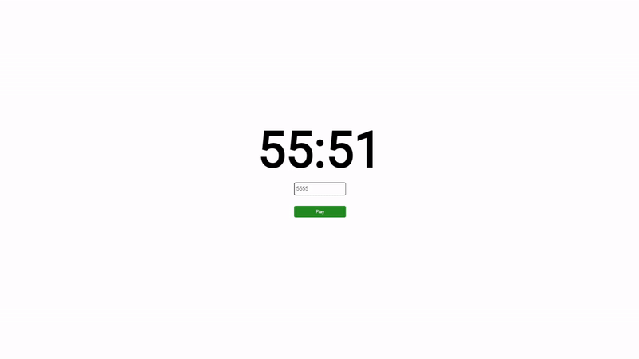

# Repeat Website

A website to type an interval to repeat and get notifications when intervals are done.

## How to use
Enter "500" to set an interval for 5 minutes.
Enter "30" to set an interval for 30 seconds.

The maximum repeat interval is 99 minutes and 60 seconds, which corresponds to "9960"

You can either press enter or use the button below the input box to Pause and Play the interval.

The website also supports the "interval" query parameter, which can be used to set the interval when the website is loaded. For example, if you want to set the interval to 5 minutes, you can go to https://tarikjaber.github.io/repeat-website/?interval=500.
